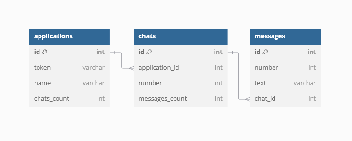
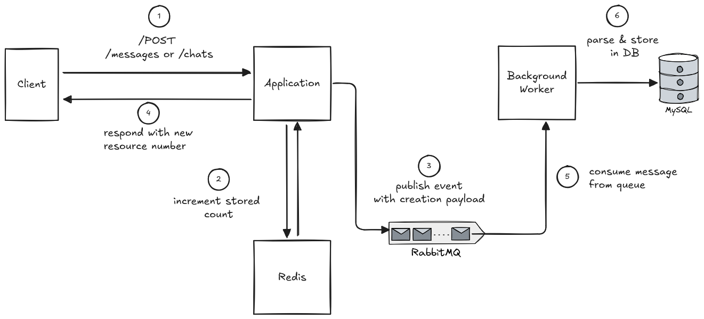

# Instabug Backend Challenge <!-- omit in toc -->

- [Overview](#overview)
  - [Used Technologies](#used-technologies)
- [Usage](#usage)
- [Database](#database)
  - [ERD](#erd)
  - [Indexes](#indexes)
- [Architecture](#architecture)
  - [Design Choices](#design-choices)
    - [Generating Unique Numbers](#generating-unique-numbers)
    - [Delete/Edit Operations](#deleteedit-operations)
    - [Timestamps](#timestamps)
    - [No Edit for Chats](#no-edit-for-chats)
    - [Count Update Jobs](#count-update-jobs)
  - [Message/Chat Creation Cycle](#messagechat-creation-cycle)
- [Endpoints](#endpoints)
- [TODO/Improvements](#todoimprovements)


# Overview

This repo is a submission for the backend challenge. 

It implements a chat system that performs the following:

- A client can create an application, each application is identified by a unique token.
- Each application can have many chats, numbered starting from 1 within an application.
- Each chat can have many messages, numbered starting from 1 within a chat.
- The system should function properly with multiple instances in parallel running and receiving requests.


## Used Technologies

- **Rails**, Ruby web framework.
- **MySQL**, relational DB.
- **Redis**, for generating unique keys.
- **RabbitMQ**, message queueing system.
- **Elasticsearch**, for efficent search over text.
- **Docker**, for containerizing app.

# Usage

After cloning the repo, run 

```
docker compose up
```

The following containers will start:


- RoR Web Application, accessible at `localhost:3000`
- RoR Workers, run in background to consume messages from RabbitMQ
- MySQL, on port `3306`
- Adminer, DBMS GUI to interact with MySQL
  - Accessible at `localhost:8080`
  - Creds are `username: admin`, `password: admin`, `server: db`
- Redis, on port `6379`
- Redis Insights, GUI for Redis
  - Accessible at `localhost:5540`
  - When adding the Redis DB, use `host: redis`, `port: 6379`
- RabbitMQ, on port `5672`
  -  Dashboard accessible at `localhost:1572`
  -  Use `username: guest`, `password: guest`
- Elasticsearch, on port `9200`
- Kibana, GUI for Elasticsearch
  - Accessible at `5601`

PS: If Elasticsearch crashes with exit 137, you might want to increase the memory limit available for docker containers. See [here](https://docs.docker.com/desktop/settings/windows/)

# Database

## ERD



## Indexes

Indexes are added for the following tables/columns:

- `applications` => `token`
- `chats` => `application_id, number`
-  `messages` => `chat_id, number`

Most operations in the system identify a chat/message by it's sequence number within it's parent. Using composite indexes for those columns helps make the operations efficent.

# Architecture

## Design Choices

### Generating Unique Numbers

The system uses Redis to generate unique numbers for messages & chats using it's `incr` operation. Multiple running instances can generate unique numbers safely because `incr` is atomic. 

### Delete/Edit Operations

Operations that delete/modify a chat or message can only happen after they are persisted. Delete and edit operations do not utilise RabbitMQ. This assumption simplifies handling of event race conditions and reduces complexity. 

The drawback is that the client might potentially need to request deletion multiple times as it can't tell the difference between a non existent resource and one pending persitence in the queue.

### Timestamps

Timestamps for a resource are specified upon inserting into DB, not at queueing time.

### No Edit for Chats

`PUT` endpoint is not implemented for chat resource, all it's attributes are system generated so it doesn't make sense for the client to modify them.

### Count Update Jobs

Jobs that update `chats_coutns` & `messages_count` run every 10 minutes. They're implemented using rufus-scheduler.

## Message/Chat Creation Cycle



# Endpoints

```
// Application

GET   /applications/
POST  /applications/ - Body => {name: string}
GET   /applications/{token}
PUT   /applications/{token}
DEL   /applications/{token}


// Chats

GET   /applications/{token}/chats
GET   /applications/{token}/chats/{number}
POST  /applications/{token}/chats
DEL   /applications/{token}/chats/{number}

// Messages

GET   /applications/{token}/chats/{chat_number}/messages
GET   /applications/{token}/chats/{chat_number}/messages?text={query}
GET   /applications/{token}/chats/{chat_number}/messages/{message_number}

POST  /applications/{token}/chats/{chat_number}/messages - Body => {text: string}
PUT   /applications/{token}/chats/{chat_number}/messages/{message_number}
DEL   /applications/{token}/chats/{chat_number}/messages/{message_number}

```

# TODO/Improvements

- [] Improve image of RoR to be in production mode
- [] Add swagger
- [] Perform batch from message queue
